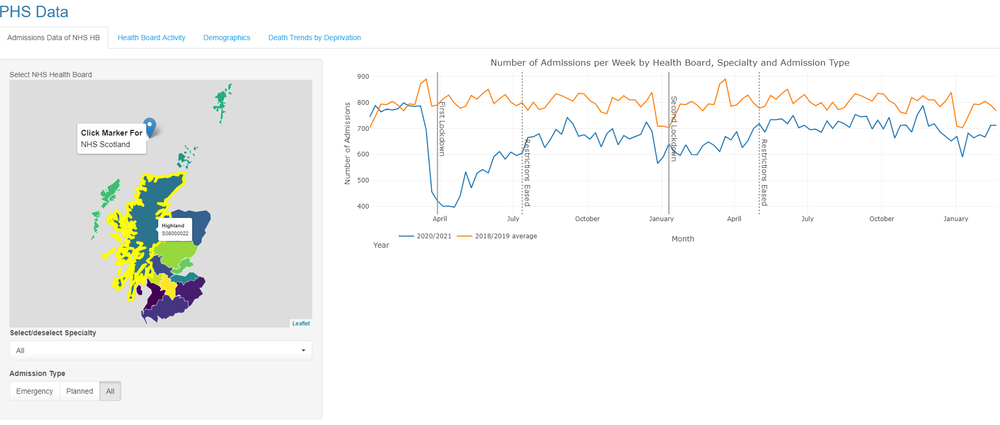
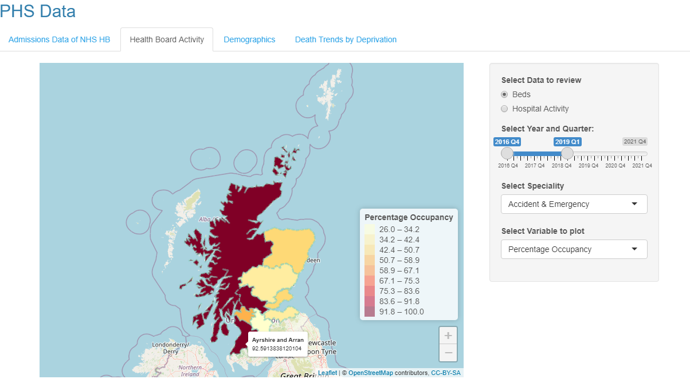
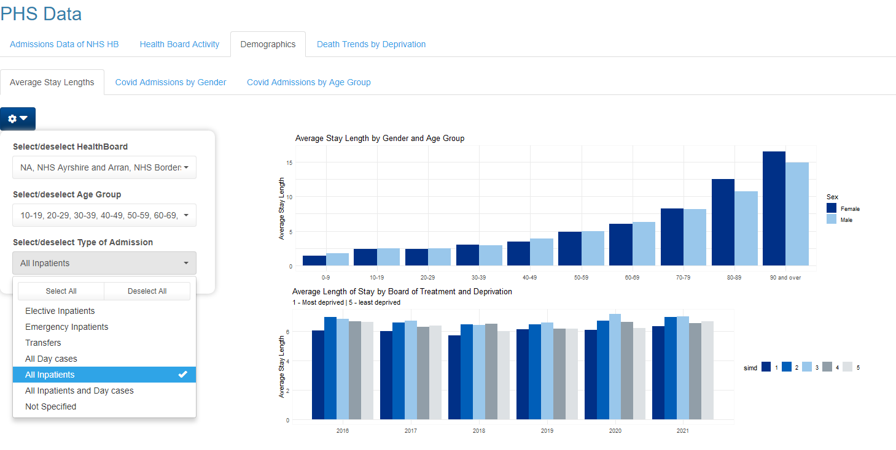
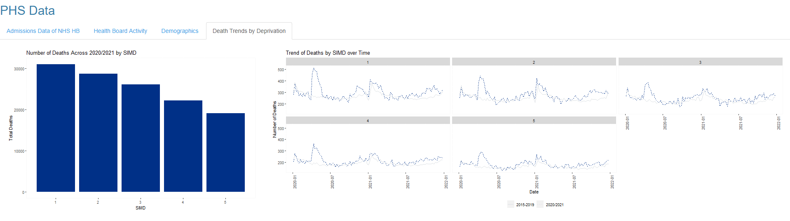
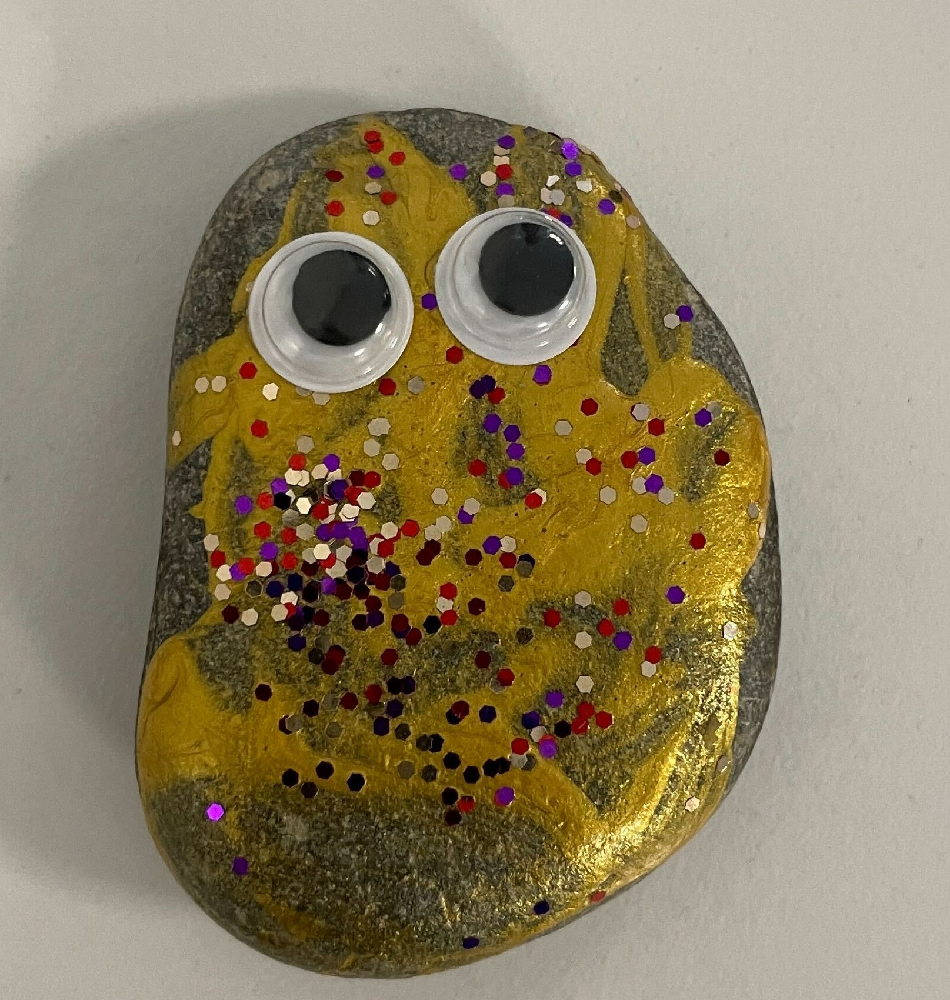

# Public Health Scotland Group Project
> The following repository is for the CodeClan group project during the 
Professional Data Analysis Course. This has been completed in week 8 of the
course. The aim of the project is to consolidate and expand what has been
learned so far:

* Data cleaning and wrangling
* Statistical analysis to identify patterns, trends or relationships 
* Data visualisation
* R Shiny
* Collaborative git

## Information
> The project is to create an RShiny app to analyse and provide details of
the effect of Winter/COVID on the NHS. The aspects to be reviewed:

  * Temporal: How has this issue changed over time? (Is it getting better or worse?)  
  
  * Geographic: How does this issue differ between areas in Scotland? (Where should efforts be focussed?)  
  
  * Demographic: Who is most affected by this issue? (Who should be targeted with efforts?)  

 

## Installations
Ensure the following packages are installed prior to running:

+ tidyverse
+ janitor
+ sf
+ tsibble
+ lubridate
+ plotly
+ shiny
+ htmlwidgets
+ shinydashboard
+ bslib
+ leaflet
+ shinyWidgets

__Run the following if required to install__
```
install.packages(tidyverse)
install.packages(janitor)
install.packages(sf)
install.packages(tsibble)
install.packages(lubridate)
install.packages(plotly)
install.packages(shiny)
install.packages(htmlwidgets)
install.packages(shinydashboard)
install.packages(bslib)
install.packages(leaflet)
install.packages(shinyWidgets)

```

## Folder Structure

The folder structure is the following:

| Folder | Description |
| :------|:-----------:|
| **01_data** | contains the raw data sets|
| **02_cleaned_data** | Contains the script for cleaning the raw data |
| **04_images** | Contains Images |
| **05_rshiny** | Contains the RShiny App |
| **06_dummy_code** | Contains some raw plots |
| **07_report** | Contains the raw data |
| **08_functions** | Contains the raw data |

## Data

All data has been obtained and is free for public use in the link with all data
coming under the following:

[Government License](https://www.nationalarchives.gov.uk/doc/open-government-licence/version/3/)

The data which has been used within this Rshiny app are:
 
* [Hospital Activity page](https://www.opendata.nhs.scot/dataset/inpatient-and-daycase-activity/resource/c3b4be64-5fb4-4a2f-af41-b0012f0a276a)  

* [Hospital Activity by Speciality](https://www.opendata.nhs.scot/dataset/inpatient-and-daycase-activity/resource/c3b4be64-5fb4-4a2f-af41-b0012f0a276a)  

* [Hospital Activity and Patient Demographics](https://www.opendata.nhs.scot/dataset/inpatient-and-daycase-activity/resource/00c00ecc-b533-426e-a433-42d79bdea5d4)  

* [Hospital Activity and Deprivation](https://www.opendata.nhs.scot/dataset/inpatient-and-daycase-activity/resource/4fc640aa-bdd4-4fbe-805b-1da1c8ed6383)  

* [Hospitalisations due to Covid 19](https://www.opendata.nhs.scot/dataset/covid-19-wider-impacts-hospital-admissions)  

* [Quarterly Hospital Beds Information - Datasets - Scottish Health and Social Care Open Data - nhs.scot](https://www.opendata.nhs.scot/dataset/hospital-beds-information)  

* [COVID Impact - Excess Deaths](https://www.opendata.nhs.scot/dataset/covid-19-wider-impacts-deaths)

* [NHS Scotland Healthboard Region Shapes](https://spatialdata.gov.scot/geonetwork/srv/eng/catalog.search#/metadata/f12c3826-4b4b-40e6-bf4f-77b9ed01dc14)


## Cleaned Data

The cleaned data has been cleaned and wrangled
 
[Simple NHS Region Shapes](02_cleaned_data/nhs_region_simple)

[Link to cleaning scripts](02_cleaned_data/cleaning_scripts)

[Link to cleaned data](02_cleaned_data)

The cleaned data is:

* activity_deprivation.csv - Hospital activity by deprivations
* activity_patient_demographics.csv - Hospital activity by demographic
* admissions_by_speciality_clean.csv - Admissions by speciality
* bed_clean.csv - Quarterly Hospital beds data
* nhs_region_simple - Simplified NHS Scotland region geometry


## Data Analysis

The files within this folder were for generation of plot/analysis prior to
loading in to RShiny app.


## RShiny App

The RShiny app visualises the data in a dashboard.

### Admissions Data of NHS HB - 
Tab shows the admission data of the each NHS healthboard. 

* Click on the region/marker on the map for different healthboard data 
* Select the speciality and admission type



### Health Board Activity - 
The healthboard activity shows a choropleth of the Quarterly beds data and the hospital
activity (episodes and stays).

* Select the data set to review (Beds or Hospital Activity)
* Select the time period (can be an individual quarter or across a few)
* Select the speciality and the variable to plot



### Demographics - 
Demographics tab showing the length of stay, covid admission by gender and 
Covid admissions by age group.

* Select the tab of data to review
* Click on the cog/settings symbol and sele
    * Healthboard
    * Age group
    * Admission type



### Death Trends by Deprivation
Shows the number of deaths split by deprivation (1 being the worst and 5 being the 
most well off).



## Report

The report details the working methodology of the group.


## Functions

The following functions are contained within the RShiny App (Leaflet Legend):

* `significance_round()` - Rounds values up or down to the nearest number of 
                            digits

| Arguments | Description |
| :---------|:-----------:|
| x | Numeric or Numeric Vector value which is to be rounded |
| round_up | Name of columns as character vector to check |
| digits | The number of digits |


[Link to function](08_functions/significance_round_function.R)

Code:
```
significance_round <- function(x, round_up = TRUE, digits = 1){
  
  if(x < 0){
    
    x <- abs(x)
    
    neg_multiplier <- -1
    
    if(round_up){
      x <- floor(x/10^ceiling(log10(x)- digits)) *10^ceiling(log10(x)- digits)
    }else{
      x <- ceiling(x/10^ceiling(log10(x)- digits)) *10^ceiling(log10(x)-digits)
    }
    
    x <- x * neg_multiplier
    
  }else{
    
    if(round_up){
      x <- ceiling(x/10^ceiling(log10(x)- digits)) *10^ceiling(log10(x)- digits)
    }else{
      x <- floor(x/10^ceiling(log10(x)- digits)) *10^ceiling(log10(x)-digits)
    }
    
  }
  return(x)
}

```

## Thanks

Special Thanks to the CodeClan Instructors and the DE15 Mascot Clive:

 
